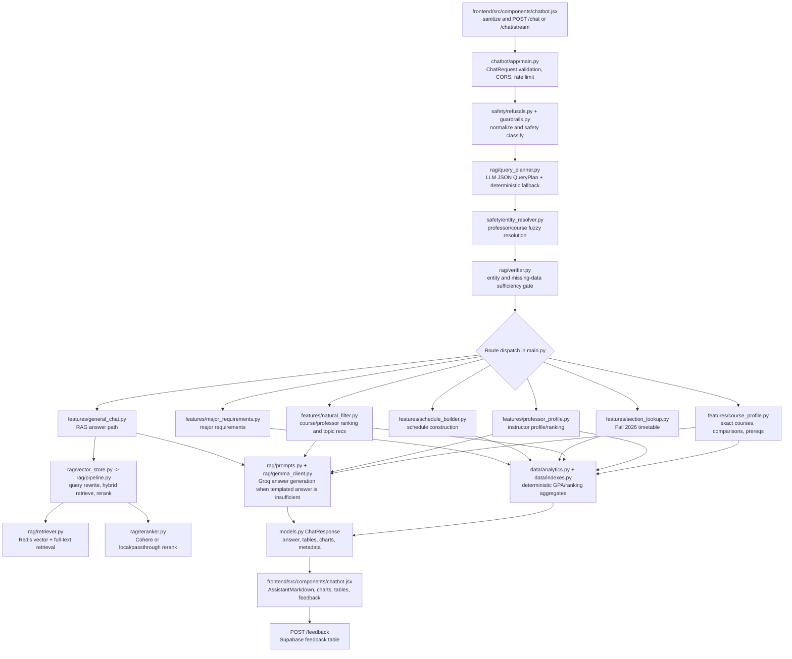

# Cyrus Architecture Audit

Date: 2026-08-02

This audit traces the Darvis/Cyrus chatbot request lifecycle before behavior changes. The current system is a FastAPI backend in `chatbot/`, a React chat UI in `frontend/`, Supabase as the durable academic data store, Redis/redisvl as the serving retrieval index, and Groq as the answer/planning LLM provider.

## Request Flow

## Backend Lifecycle Files

- API routes, lifecycle loading, route dispatch, rate limits, CORS, streaming: `chatbot/app/main.py`
- Request/response schemas: `chatbot/app/models.py`
- Runtime settings and model/retrieval provider env vars: `chatbot/app/config.py`
- Data loading from Supabase: `chatbot/app/data/loader.py`
- Precomputed lookup indexes: `chatbot/app/data/indexes.py`
- Deterministic grade/ranking calculations: `chatbot/app/data/analytics.py`
- Intent planning: `chatbot/app/rag/query_planner.py`, `chatbot/app/rag/planner_models.py`
- Entity resolution: `chatbot/app/safety/entity_resolver.py`
- Sufficiency/missing-data gate: `chatbot/app/rag/verifier.py`
- Retrieval orchestration: `chatbot/app/rag/vector_store.py`, `chatbot/app/rag/pipeline.py`
- Hybrid Redis retrieval: `chatbot/app/rag/retriever.py`, `chatbot/app/rag/redis_schema.py`
- Query rewrite, reranking, observability: `chatbot/app/rag/query_rewriter.py`, `chatbot/app/rag/reranker.py`, `chatbot/app/rag/observability.py`
- Prompt construction and LLM client: `chatbot/app/rag/prompts.py`, `chatbot/app/rag/gemma_client.py`
- Route handlers: `chatbot/app/features/*.py`
- Frontend chat submission/rendering/feedback: `frontend/src/components/chatbot.jsx`
- Frontend API URL config: `frontend/src/config.js`
- Feedback schema source: `chatbot/app/models.py`, `chatbot/migrations/004_feedback_reason.sql`, `backend/supabase/schema.sql`

## Current Provider Configuration

- Groq chat/planner model via OpenAI-compatible client: `GROQ_API_KEY`, `GROQ_MODEL`, default `openai/gpt-oss-120b`
- OpenAI embeddings optional: `OPENAI_API_KEY`, `RAG_OPENAI_MODEL`, default `text-embedding-3-small`
- Cohere reranking optional: `COHERE_API_KEY`
- Local fallbacks: `fastembed` for embeddings, optional `sentence-transformers` reranker when enabled
- Redis/redisvl retrieval index: `REDIS_URL`, `RAG_REDIS_INDEX_NAME`
- Supabase data: `SUPABASE_URL`, `SUPABASE_KEY`

## Structured Schemas

Current public schema is `ChatResponse` in `chatbot/app/models.py`: free-text `answer`, `route`, warnings, tables, charts, metadata, and schedule actions. Tables/charts are typed, but final answer types such as `course_recommendation`, `course_comparison`, `professor_recommendation`, `insufficient_data`, and `clarification_required` are not yet first-class response schemas. Query planning is structured through `QueryPlan` in `chatbot/app/rag/planner_models.py`.

This change adds opt-in eval metadata to `ChatRequest` (`eval_mode`, `eval_case_id`) and records a sanitized `metadata.eval_trace` for evaluated requests. It does not change default user-facing behavior.

## Responsibility Mixing

- `features/natural_filter.py` mixes topic extraction, subject priors, ranking, table shaping, and final prose.
- `features/course_profile.py` mixes course comparison calculations, description formatting, section summaries, and answer wording.
- `main.py` owns planning, entity resolution, sufficiency gating, route dispatch, secondary route fan-out, and response metadata assembly.
- Final answer text can still mention entities outside table payloads because the backend returns free text plus structured tables rather than a validated typed answer object.
- Frontend renders backend tables and charts, but also renders LLM/handler Markdown headings and layout choices from `answer`.

## Likely Weaknesses

- Retrieval: Redis retrieval is strong for hybrid search, but handler fallbacks can answer from broad RAG context when deterministic filters return empty.
- Ranking: topic recommendation scoring in `natural_filter.py` is deterministic but local and heuristic; grade quality can still dominate outside the topic path.
- Entity resolution: exact course handling is better than professor ambiguity handling, but planner extraction can still choose an adjacent or broadened route before resolver correction.
- Sufficiency: `verifier.py` checks missing fields and course existence, but it does not yet validate every retrieved/ranked candidate against requested entities or hard exclusions.
- Grounding: `ChatResponse.answer` is not schema-validated against tables, charts, or metadata, so unsupported entity/numeric claims must be caught by evals.
- Formatting: the frontend cannot fully control layout while the answer remains Markdown text with headings/lists chosen by backend/LLM output.

## Test And Run Commands

- Backend local server: `cd chatbot && uvicorn app.main:app --reload`
- Backend tests: `cd chatbot && python -m pytest tests/`
- Existing workbook evals: `python evals/run_rag_qa.py --all --endpoint http://127.0.0.1:8000/chat`
- New Cyrus evals: `python evals/run.py --all --endpoint http://127.0.0.1:8000/chat`
- Frontend dev server: `cd frontend && npm run dev`
- Frontend production build: `cd frontend && npm run build`
- Frontend lint/typecheck: not configured
- Chatbot lint/typecheck: not configured
- Integration tests: no dedicated integration suite found beyond endpoint-driven eval scripts

## Existing Evaluation And Feedback

- Existing eval scripts: `evals/run_rag_qa.py`, `evals/judge_response.py`, `evals/report_results.py`, `evals/load_qa_workbook.py`
- Existing saved results: `evals/results/latest_results.json`, `evals/results/latest_results.csv`, security result subdirectory
- Workbook artifact: `outputs/rag_qa_workbook/rag_llm_fallback_qa_test_workbook_completed.xlsx`
- Feedback ingestion: frontend posts thumbs up/down to `/feedback`; backend writes `question`, `answer`, `route`, `rating`, optional `reason` into Supabase `feedback`
- Feedback review: `GET /feedback/recent` guarded by `DEV_FEEDBACK_TOKEN`

## Missing Tests

- Stage-level evals for planner intent, entity resolution, retrieval precision/recall, reranking quality, and sufficiency.
- Deterministic grounding checks that every course/professor/numeric claim in answer text is supported by tables/metadata.
- Format compliance by answer type.
- Regression tests for wrong-entity retrieval prevention, exact course comparisons, AI/ML topic exclusions, prerequisite claims, and professor recommendations tied to a requested course.
- Frontend rendering tests for answer types, table order, and unsupported free-text layout choices.
